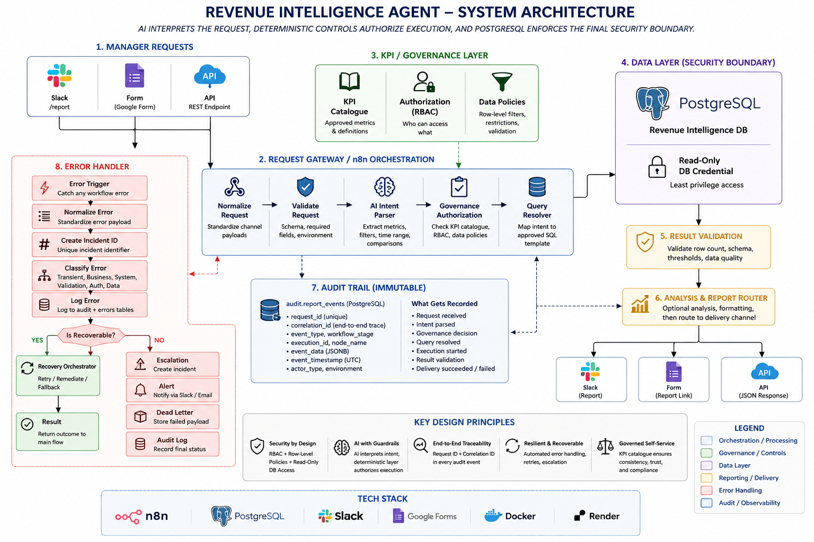
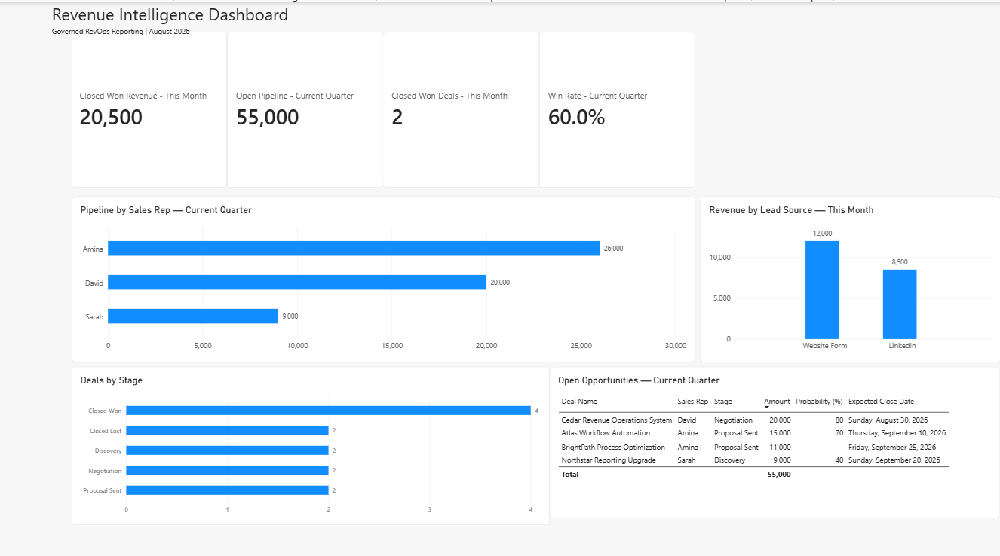

# AI Revenue Intelligence & Reporting Agent

A governed self-service revenue reporting system that turns manager questions into validated, auditable insights across **Slack, web forms, REST APIs, PostgreSQL, n8n, and Power BI**.

> **Design principle:** AI interprets the request. Deterministic controls authorize execution. PostgreSQL permissions enforce the final security boundary.

## Business problem

Revenue and operations managers often need quick answers about revenue, pipeline, deal stages, lead sources, and sales performance. A naive AI-to-database design can make those answers faster, but it can also introduce arbitrary SQL execution, inconsistent KPI definitions, unsupported filters, and weak auditability.

This project separates **AI intent interpretation** from **query authorization and execution**.

## Architecture



```text
Manager Request
Slack / Form / API
        ↓
n8n Request Gateway
        ↓
Normalize + Validate
        ↓
AI Intent Parser
        ↓
KPI Catalogue + Governance
        ↓
Approved Query Resolver
        ↓
Safe Runtime Parameters
        ↓
Approved SQL Template
        ↓
PostgreSQL Reporting DB
READ-ONLY CREDENTIAL
        ↓
Result Validation
        ↓
Analysis + Report Router
        ↓
Slack / Form / API
        ↓
Audit Trail
```

### Failure path

```text
Error Trigger
      ↓
Normalize Error
      ↓
Create Incident ID
      ↓
Classify + Log
      ↓
Is Recoverable?
   /             \
 YES              NO
  ↓                ↓
Recovery        Escalation
  ↓                ↓
Result           Alert
                   ↓
               Dead Letter
                   ↓
               Final Audit
```

## Key capabilities

- Natural-language manager requests through Slack, form, or API
- Structured AI intent parsing without AI-generated executable SQL
- Governed KPI catalogue with approved dimensions, filters, date fields, row limits, and query mappings
- Approved SQL templates with parameterized runtime values
- PostgreSQL least-privilege access with a dedicated read-only reporting role
- Safe rejection of unsupported or unauthorized reporting requests
- Multi-channel report delivery
- Power BI management dashboard
- Request ID, correlation ID, execution ID, and timestamped audit events
- Centralized error classification, recovery, escalation, alerting, and dead-letter handling

## Technology stack

| Area | Technology |
|---|---|
| Workflow orchestration | n8n |
| Database | PostgreSQL |
| Infrastructure | Docker |
| AI integration | Structured LLM intent parsing |
| Manager channels | Slack, Web Form, REST API |
| Analytics | Power BI |
| Audit logging | PostgreSQL |
| Error management | Centralized n8n error workflow |

## Governed query execution

The AI does **not** receive permission to generate and execute arbitrary SQL.

```text
Manager question
      ↓
Structured intent
      ↓
KPI validation
      ↓
Approved query key
      ↓
Approved SQL template
      ↓
Parameterized values
      ↓
Read-only PostgreSQL execution
```

## Database security boundary

The reporting credential is intentionally restricted. It can read approved reporting tables but cannot modify reporting facts or access the control and audit schemas. Control operations use a separate credential with a different permission boundary.

## Power BI dashboard



Verified portfolio dataset results include:

| KPI | Result |
|---|---:|
| Closed Won Revenue — This Month | 20,500 |
| Open Pipeline — Current Quarter | 55,000 |
| Closed Won Deals — This Month | 2 |
| Win Rate — Current Quarter | 60.0% |

Additional views include pipeline by sales rep, deals by stage, revenue by lead source, and open opportunities with probability and expected close date.

## Audit traceability

A manager request can be traced through consistent identifiers across its lifecycle:

```text
request_received
      ↓
intent_parsed
      ↓
governance_approved
      ↓
delivery_succeeded
```

Audit records capture request identity, correlation identity, workflow execution, stage, event type, and timestamp for operational review and debugging.

## Security model

1. Request validation
2. Structured AI intent
3. KPI catalogue governance
4. Filter and dimension authorization
5. Approved query templates
6. Parameterized SQL
7. PostgreSQL least-privilege permissions
8. Result validation
9. Audit logging
10. Centralized error handling

## Evidence

The `docs/images/` folder is reserved for the verified portfolio evidence set:

- `revint-01-main-orchestrator.png`
- `revint-02-approved-api-report.png`
- `revint-03-safe-rejection.png`
- `revint-04-postgres-security.png`
- `revint-05-kpi-catalogue.png`
- `revint-06-slack-report.png`
- `revint-07-form-report.png`
- `revint-08-powerbi-dashboard.png`
- `revint-09-audit-traceability.png`
- `revint-10-error-handler.png`

## Repository safety

This public repository should contain **sanitized portfolio artifacts only**. Never commit credentials, API keys, authentication secrets, database passwords, local secret files, `.env` files, or unsanitized n8n workflow exports.

## What this project demonstrates

**Revenue Operations:** KPI governance, pipeline reporting, revenue reporting, sales performance analysis

**Business Systems:** workflow architecture, data governance, access controls, operational reliability

**CRM / Sales Operations:** deal stages, opportunity reporting, lead-source analysis, sales-rep pipeline reporting

**Data & Reporting:** PostgreSQL, SQL, Power BI, KPI definitions, reporting datasets

**Automation:** n8n, APIs, Slack integrations, error handling, routing

**AI Workflow Design:** structured intent extraction, deterministic authorization, separation of AI interpretation from privileged execution

## Author

**Ganiyu Basirat Olanike**  
Operations | Revenue Operations | Business Systems | CRM | Data & Reporting | AI & Workflow Automation

Portfolio: https://nikkytechies-portfolio.vercel.app/  
GitHub: https://github.com/Nikkypwetti  
LinkedIn: https://www.linkedin.com/in/ganiyu-basirat-308ab9403
