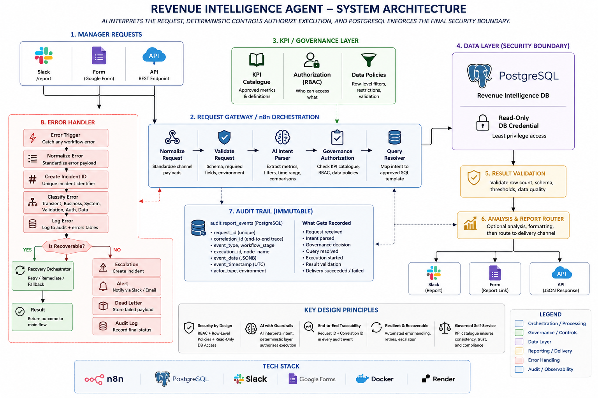
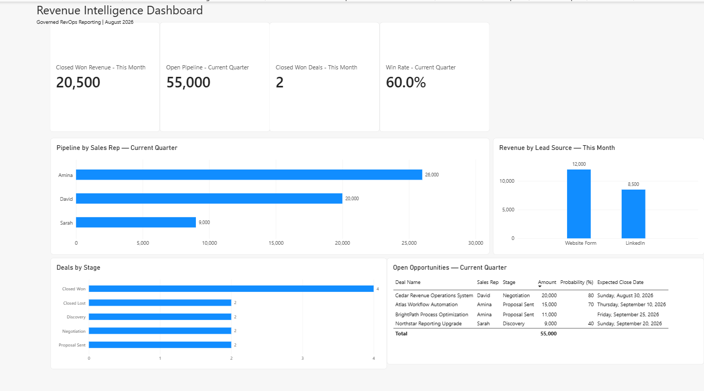

# AI Revenue Intelligence & Reporting Agent

A governed self-service revenue reporting system that turns manager questions into validated, auditable insights across **Slack, web forms, REST APIs, PostgreSQL, n8n, and Power BI**.

> **Design principle:** AI interprets the request. Deterministic controls authorize execution. PostgreSQL permissions enforce the final security boundary.


## Agent v2 — deployable business edition

Stages 1–4, the KPI semantic layer, identity/permissions, the governed Agent execution core, Scheduled Intelligence, the runtime Reliability core, Monitoring & Observability, Backup & Recovery, Upgrade & Rollback, and HTTPS & Public Ingress are merged and locally verified. The External Authentication / SSO foundation is also locally verified in its disabled-by-default state on the isolated Agent v2 deployment.

**Stage 1** provides the reproducible single-business Docker deployment foundation with separate n8n and reporting databases, persistent volumes, health checks, local-only access, environment-based configuration, and deployment validation.

**Stage 2** adds client-specific business configuration, a versioned KPI catalogue, and least-privilege reporting/audit database roles.

**Stage 3** adds non-secret connector mapping configuration, deterministic source normalization, a canonical `reporting.deals` contract, a least-privilege connector-ingestion role, and approved query templates that resolve the four governed KPI query keys.

**Stage 4** connects those controls to the isolated n8n runtime with encrypted least-privilege credentials and an authenticated REST deal-ingestion workflow that writes only through the controlled canonical ingestion gateway.

**KPI semantic-layer completion** preserves the existing four KPI definitions and query keys while adding explicit formula metadata, governed dimension/filter/date-field catalogues, normalized KPI policies, and deterministic semantic resolution.

**Identity & permissions** extends the existing role-policy model with provider-neutral principals, departments, role assignments, row limits, and deterministic own/department/all-business data scopes. No real client users or departments are seeded.

**Agent execution core** adds authenticated report intake, bounded deterministic natural-language fallback, safe clarification, identity-aware execution across the governed Revenue Question Pack, approved filters/dimensions, comparison/breakdown/diagnostic modes, and delivery-neutral presentation artifacts.

**Governed Intelligence Adapter** ports the useful Groq intent-parser and management-summary concepts from the earlier 118-node `REVINT-01` workflow into an internal V2 sub-workflow. It is safe-disabled by default, uses its own encrypted Agent V2 Groq credential, returns the existing structured-intent contract, falls back to deterministic interpretation on provider failure, and can summarize only already-governed report facts.

**Salesforce connector** adds a disabled-by-default incremental Opportunity adapter for the first-client AsterNova CRM, with a dedicated encrypted OAuth credential boundary, fixed-field time-bounded SOQL, deterministic stage normalization, canonical ingestion, cursor/audit completion, and an explicit read-only attestation before activation. See `docs/salesforce-connector.md`.

**HubSpot connector** adds a disabled-by-default incremental Deals adapter using the current HubSpot CRM search API, a dedicated encrypted read credential, deterministic open/won/lost normalization, a bounded batch wrapper around the existing Stage 3 ingestion gateway, persisted sync cursor state, explicit activation confirmation, isolated n8n CLI deployment, and configurable outbound DNS. The reusable deployment path has been validated against a live read-only HubSpot source while the repository itself contains no HubSpot credential and remains safe-disabled by default. See `docs/hubspot-connector.md`.

**Scheduled Intelligence** adds daily and weekly n8n schedules, governed stale-open-deal and missing-close-date checks, material pipeline-movement detection against the previous snapshot, seven-day closed-won context, and append-only proactive intelligence events. It reuses the existing reporting-reader and audit-writer credentials and does not copy Slack/email credentials from the protected old n8n instance.

**Reliability core** adds bounded three-attempt retries for safe database operations, a dedicated Agent v2 Error Trigger workflow, deterministic terminal-failure classification, idempotent dead-letter persistence, conflict-safe audit retries, and per-component circuit breakers with controlled half-open probes.

**Monitoring & Observability** adds governed component/overall runtime status views, alert-ready circuit/failure/dead-letter rows, a bounded runtime snapshot function, and a five-minute Agent v2 heartbeat that persists snapshot history through the existing Audit Writer boundary.

**Governed Incident Notifications** consumes only the bounded `observability.alert_ready` surface, applies trusted severity/cooldown/deduplication policy, sends through a dedicated Slack incident credential and trusted destination, and routes final provider failures back through the reliability/dead-letter core. It remains disabled until a real incident channel/token is configured. See `docs/incident-notifications.md`.

**Backup & Recovery** adds atomic owner-only backups of both Agent v2 PostgreSQL databases and the n8n persistent data volume, SHA-256 integrity manifests, encryption-key fingerprint validation, isolated restore drills, a guarded live-restore path with mandatory pre-restore backup, 14-day local retention, and an idempotent daily cron schedule.

**Upgrade & Rollback** adds immutable digest-pinned runtime images, drift-detecting release checkpoints, checkpoint-first upgrades, PostgreSQL-major upgrade protection, health-gated deployment, exact-image rollback metadata, guarded rollback integration, and full post-change regression verification.

**HTTPS & Public Ingress** adds a digest-pinned nginx TLS edge, HTTP-to-HTTPS redirect, one-hop trusted-proxy handling, exact webhook-route allowlisting, editor/UI blocking, a read-only non-privileged ingress container, private/public Docker network separation, and an explicit confirmation guard before any non-loopback bind.

**External Authentication / SSO** adds a provider-neutral OIDC edge through OAuth2 Proxy, deterministic external-subject-to-principal resolution, an encrypted internal edge-to-n8n credential, spoof-resistant principal binding, explicit user-to-principal mapping, and guarded production activation. The local deployment keeps `SSO_ENABLED=false`; no real external identity provider is activated or claimed as tested.

**Governed Delivery Adapter** migrates the trusted Slack report-delivery concept from the earlier REVINT-01 workflow into Agent V2. Delivery occurs only after report authorization/presentation, is tenant- and role-gated, resolves destination from trusted governance rather than caller/AI input, uses a dedicated encrypted Agent V2 Slack credential, and remains disabled by default until a real client channel/token is configured. See `docs/delivery-adapter-v2.md`.

See [Stage 1 deployment documentation](docs/deployment-stage-1.md), [Stage 2 documentation](docs/deployment-stage-2.md), [Stage 3 documentation](docs/deployment-stage-3.md), [Stage 4 runtime documentation](docs/deployment-stage-4.md), [KPI semantic-layer documentation](docs/semantic-layer.md), [identity/permissions documentation](docs/identity-permissions.md), [Agent execution-core documentation](docs/agent-execution-core.md), [Governed Intelligence Adapter documentation](docs/intelligence-adapter-v2.md), [Reusable Security Gateway documentation](docs/security-gateway.md), [Scheduled Intelligence documentation](docs/scheduled-intelligence.md), [Reliability documentation](docs/reliability-core.md), [Monitoring & Observability documentation](docs/observability-core.md), [Backup & Recovery documentation](docs/backup-recovery.md), [Upgrade & Rollback documentation](docs/upgrade-rollback.md), [HTTPS & Public Ingress documentation](docs/https-ingress.md), and [External Authentication / SSO documentation](docs/external-sso.md), plus [SSO Manager Form documentation](docs/manager-form-v2.md).

> These stages are production-foundation work, not a claim of full production readiness. The governed LLM adapter is implemented but remains safe-disabled until a dedicated Agent V2 Groq credential is configured. Additional CRM/billing adapters (such as Salesforce/Airtable), external Slack/email delivery and incident notifications, encrypted off-site backup replication, activation on a real public domain with a trusted production certificate, and an end-to-end login against the client's real identity provider remain deployment work. The HubSpot connector is live-validated locally but each client deployment still requires its own read-only credential, mapping/configuration review, and isolated environment.

## First real client implementation

Agent V2 now includes a secret-free implementation pack for the owner's own HubSpot, Salesforce, and Airtable CRM stack. HubSpot has been reviewed against the live portal; the AsterNova Salesforce Opportunity stages are mapped into the canonical deal contract; Airtable is supported by the connector validator but remains fail-closed until its live field schema can be re-read after the API quota resets.

See [First Client Implementation](docs/first-client-implementation.md) and [first-client connector mappings](config/first-client.connectors.example.json).

A GitHub Actions static-verification workflow validates JSON, shell syntax, client connector policy, and secret-like committed file names on pull requests and pushes to main.

## Local production hardening without VPS/domain

The current laptop deployment can complete substantial production hardening before any VPS or domain purchase. The repository now includes a non-destructive PostgreSQL 17 restore rehearsal, bounded local report API load testing, encrypted off-device backup replication, and reusable HubSpot/Salesforce/Airtable sync governance.

See [Local Production Hardening](docs/local-production-hardening.md).

## Project Walkthrough

For a business-first explanation of the problem, architecture, personal ownership, live evidence, security model, recovery story, reusable CRM design, and current activation state, see [Agent V2 Project Walkthrough](docs/project-walkthrough.md).

## Local Control Dashboard

**REVINT-V2-CONTROL-01** adds a local-only, read-only Control Center for Agent V2 operations. It uses the existing Reporting RO credential to show governed KPI count, connector activation, runtime/component health, circuit state, recent failures, dead-letter backlog and active observability alerts. The route is GET-only, loopback-only, excluded from the public nginx ingress, and contains no mutation controls.

Deploy explicitly with:

```bash
bash scripts/deploy-control-dashboard.sh --confirm REVINT_CONTROL_DASHBOARD
```

Then open `http://localhost:5681/webhook/revint/v2/control` (or the configured Agent V2 port).

See [Control Dashboard documentation](docs/control-dashboard-v2.md).

## Power BI local handoff

**Power BI local handoff** exports canonical deal facts plus bounded component/runtime status through the existing Reporting RO credential into checksum-protected, Git-ignored CSV packages. It is a business-wide trusted management extract and does not create a public database endpoint. See [Power BI Local Dataset Handoff](docs/powerbi-handoff-v2.md).

## Airtable + email delivery adapters

**Airtable connector** adds a disabled-by-default, read-only Opportunity sync using n8n Airtable v2 search, dedicated PAT credential `REVINTAIRTABLE001`, generic multi-CRM cursor/reliability governance, and canonical ingestion. Activation is blocked until the real client field/stage mappings replace every placeholder. See [Airtable Connector](docs/airtable-connector.md).

**Gmail report delivery** adds an internal-only governed email adapter using dedicated OAuth credential `REVINTGMAILREPORT001`. The recipient is resolved from server-side governance and cannot be supplied by AI or the caller. See [Email Delivery](docs/email-delivery.md).

## Revenue Question Pack

- [37 governed KPIs and reusable data-domain model](docs/revenue-question-pack-v2.md)

## Business problem

Revenue and operations managers often need quick answers about revenue, pipeline, deal stages, lead sources, and sales performance. A naive AI-to-database design can make those answers faster, but it can also introduce arbitrary SQL execution, inconsistent KPI definitions, unsupported filters, and weak auditability.

This project separates **AI intent interpretation** from **query authorization and execution**.

## Architecture



```text
Manager Request
Slack / Form / API
        ↓
n8n Request Gateway
        ↓
Normalize + Validate
        ↓
AI Intent Parser
        ↓
KPI Catalogue + Governance
        ↓
Approved Query Resolver
        ↓
Safe Runtime Parameters
        ↓
Approved SQL Template
        ↓
PostgreSQL Reporting DB
READ-ONLY CREDENTIAL
        ↓
Result Validation
        ↓
Analysis + Report Router
        ↓
Slack / Form / API
        ↓
Audit Trail
```

### Failure path

```text
Error Trigger
      ↓
Normalize Error
      ↓
Create Incident ID
      ↓
Classify + Log
      ↓
Is Recoverable?
   /             \
 YES              NO
  ↓                ↓
Recovery        Escalation
  ↓                ↓
Result           Alert
                   ↓
               Dead Letter
                   ↓
               Final Audit
```

## Key capabilities

- Natural-language manager requests through Slack, form, or API
- Structured AI intent parsing without AI-generated executable SQL
- Governed KPI catalogue with approved dimensions, filters, date fields, row limits, and query mappings
- Approved SQL templates with parameterized runtime values
- PostgreSQL least-privilege access with a dedicated read-only reporting role
- Safe rejection of unsupported or unauthorized reporting requests
- Multi-channel report delivery
- Power BI management dashboard
- Request ID, correlation ID, execution ID, and timestamped audit events
- Centralized error classification, recovery, escalation, alerting, and dead-letter handling

## Technology stack

| Area | Technology |
|---|---|
| Workflow orchestration | n8n |
| Database | PostgreSQL |
| Infrastructure | Docker |
| AI integration | Structured LLM intent parsing |
| Manager channels | Slack, Web Form, REST API |
| Analytics | Power BI |
| Audit logging | PostgreSQL |
| Error management | Centralized n8n error workflow |

## Sanitized n8n workflow exports

Portfolio-safe versions of the three core n8n workflows are included in the repository:

- [REVINT-01 — Manager Request Orchestrator](workflows/sanitized-workflow-exports/REVINT-01.sanitized.json)
- [REVINT-06 — Manager Form Gateway](workflows/sanitized-workflow-exports/REVINT-06.sanitized.json)
- [REVINT-SYS-01 — Error Handler](workflows/sanitized-workflow-exports/REVINT-SYS-01.sanitized.json)

See the [workflow documentation](workflows/README.md) for responsibilities, security boundaries, and publication notes.

> These are sanitized portfolio exports. Credentials, secrets, instance metadata, and private runtime configuration are intentionally excluded.

## Governed query execution

The AI does **not** receive permission to generate and execute arbitrary SQL.

```text
Manager question
      ↓
Structured intent
      ↓
KPI validation
      ↓
Approved query key
      ↓
Approved SQL template
      ↓
Parameterized values
      ↓
Read-only PostgreSQL execution
```

## Database security boundary

The reporting credential is intentionally restricted. It can read approved reporting tables but cannot modify reporting facts or access the control and audit schemas. Control operations use a separate credential with a different permission boundary.

## Power BI dashboard



Verified portfolio dataset results include:

| KPI | Result |
|---|---:|
| Closed Won Revenue — This Month | 20,500 |
| Open Pipeline — Current Quarter | 55,000 |
| Closed Won Deals — This Month | 2 |
| Win Rate — Current Quarter | 60.0% |

Additional views include pipeline by sales rep, deals by stage, revenue by lead source, and open opportunities with probability and expected close date.

## Audit traceability

A manager request can be traced through consistent identifiers across its lifecycle:

```text
request_received
      ↓
intent_parsed
      ↓
governance_approved
      ↓
delivery_succeeded
```

Audit records capture request identity, correlation identity, workflow execution, stage, event type, and timestamp for operational review and debugging.

## Security model

1. Request validation
2. Structured AI intent
3. KPI catalogue governance
4. Filter and dimension authorization
5. Approved query templates
6. Parameterized SQL
7. PostgreSQL least-privilege permissions
8. Result validation
9. Audit logging
10. Centralized error handling

## Evidence

The `docs/images/` folder is reserved for the verified portfolio evidence set:

- `revint-01-main-orchestrator.png`
- `revint-02-approved-api-report.png`
- `revint-03-safe-rejection.png`
- `revint-04-postgres-security.png`
- `revint-05-kpi-catalogue.png`
- `revint-06-slack-report.png`
- `revint-07-form-report.png`
- `revint-08-powerbi-dashboard.png`
- `revint-09-audit-traceability.png`
- `revint-10-error-handler.png`

## Repository safety

This public repository should contain **sanitized portfolio artifacts only**. Never commit credentials, API keys, authentication secrets, database passwords, local secret files, `.env` files, or unsanitized n8n workflow exports.

## What this project demonstrates

**Revenue Operations:** KPI governance, pipeline reporting, revenue reporting, sales performance analysis

**Business Systems:** workflow architecture, data governance, access controls, operational reliability

**CRM / Sales Operations:** deal stages, opportunity reporting, lead-source analysis, sales-rep pipeline reporting

**Data & Reporting:** PostgreSQL, SQL, Power BI, KPI definitions, reporting datasets

**Automation:** n8n, APIs, Slack integrations, error handling, routing

**AI Workflow Design:** structured intent extraction, deterministic authorization, separation of AI interpretation from privileged execution

## Author

**Ganiyu Basirat Olanike**  
Operations | Revenue Operations | Business Systems | CRM | Data & Reporting | AI & Workflow Automation

Portfolio: https://nikkytechies-portfolio.vercel.app/  
GitHub: https://github.com/Nikkypwetti  
LinkedIn: https://www.linkedin.com/in/ganiyu-basirat-308ab9403
